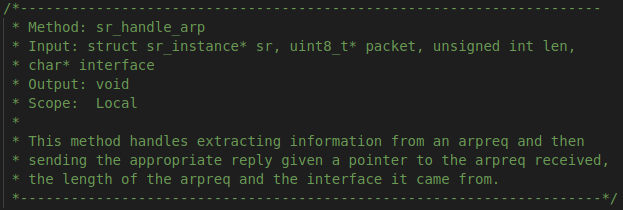

# CSCD58 Assignment 1 Simple Router Implementation

Completed by Linda Lo in Fall 2021.  The implementation covers the basic functionalities required in Assignment 1: Simple Router and can be run using the instructions in the assignment sheet.

## Table of Contents
- [Code Description](#code-description)
     * [Structure](#structure)
     * [Modified Files](#modified-files)
     * [Detailed Function Description](#detailed-function-description)
- [Testing](#testing)

## Code Description

The following is a quick overview of the functions created to implement the functionality:

- Builder functions (local): `sr_create_etherframe`, `sr_create_arppacket`, `sr_create_ippacket`, `sr_create_icmppacket` in `sr_router.c`
- Handling helper functions (local): `sr_handle_arp`, `sr_handle_ippacket`, `sr_forward_ippacket` in `sr_router.c` 
- Sending functions (global): `sr_send_icmp`, `sr_send_arp` in `sr_router.h`/`sr_router.c`
- ARP cache helper function (local): `sr_handle_arpreq_queue` in `sr_arpcache.c`
- LPM lookup (global): `sr_rt_lookup` in `sr_rt.h`/`sr_rt.c`

Please see [Detailed Function Description](#detailed-function-description) for more information on each of the helper functions.

### Structure

The code is split into two main processes, one for handling packets received at the router, and one for managing the arp cache.

**Packet Handling:**
<!-- language: lang-none -->
         1
    arp / \ ip
       2   3
            \ forwarding
             4

1. `sr_handlepacket` receives the packet and checks the integrity of the ethernet frame. Then it examines the protocol and calls
either `sr_handle_arp` or `sr_handle_ippacket`.
2. `sr_handle_arp` checks the type of the addresses are ethernet and ip, then handles the packet based on whether it is a reply or a 
request.  If it's a request, it caches the sender's information and calls `sr_send_arp` to send out an arp reqly.  Otherwise, it caches
the information from a reply and loops through the arp request queue of the router to send out packets to the correct destination using
`sr_create_etherframe` and `sr_send_packet`. (NOTE: in the version I have created, only the ip packets are stored in the queue)
3. `sr_handle_ippacket` checks the length and checksum of the packet, making sure to reset the fields afterards.  It then determines
whether the packet is destined for one of the router interfaces. If the destination is this router it checks the protocol: if it is ICMP, it checks the checksum is correct then sends the appropriate response using `sr_send_icmp`.  Otherwise, if it is TCP/UDP it uses `sr_send_icmp` to reply with a port unreacheable message.  Finally, if the destination is NOT this router, it will check the TTL, using `sr_send_icmp` to send a time exceeded
message if TTL=1 and using `sr_forward_ippacket` if the check succeeds.
4. `sr_forward_packet` will use the function `sr_rt_lookup` to find the lpm, if not found it will use `sr_send_icmp` to send a destination unreacheable message back to the sender.  If lpm exists, it will then check the ARP cache for the hardware information, sending the packet with
`sr_create_etherframe` and `sr_send_packet` if found it will send the packet right away, otherwise it will use `sr_arp_queuereq` to queue the ip
packet.

**ARP Cache**
1. `sr_arpcache_sweepreqs` loops through each of the requests in the request queue and calls `sr_handle_arpreq_queue`.
2. `sr_handle_arpreq_queue` checks whether the time is greater than 1 second on a request, then either sends out another request for that destination using `sr_send_arp`, updating the time and time sent, OR if there has been >5 attempts, uses `sr_send_icmp` to send an ICMP destination unreacheable and destroys the request queue.

### Modified Files

These are the detailed modifications that were made to the original code

>`sr_router.h`
- Function declarations for `sr_send_icmp`, `sr_send_arp`
> `sr_router.c`
- Function declarations for `sr_create_etherframe`, `sr_create_arppacket`, `sr_create_ippacket`, `sr_create_icmppacket` `sr_handle_arp`, `sr_handle_ippacket`, `sr_forward_ippacket`
- Function implementations for the above functions and the functions declared in `sr_router.h`
- Global variable declarations for `ether_broadcast_addr` and `ip_broadcast_addr`
- Global variable definitions in `sr_init`
- Implementation of `sr_handle_packet` and update to function description
> `sr_if.h`
- Added typedef for `sr_if_t`
> `sr_rt.h`
- Function declaration for `sr_rt_lookup`
> `sr_rt.c`
- Function definition for `sr_rt_lookup`
- Added typedef for `sr_rt_t`
> `sr_arpcache.h`
- Modification to `sr_packet` to include `sender` as incoming interface and changed comments to refer to ip packet
- Typedefs for `sr_packet_t`, `sr_arpentry_t` and `sr_arpreq_t`
>`sr_arpcache.c`
- Function declaration for `sr_handle_arpreq_queue`
- Function definition of `sr_handle_arpreq_queue`
- Implementation of `sr_arpcache_sweepreqs` and update to function description
> `sr_protocol.h`
- Renamed sr_arp_hdr struct to `sr_arp_packet`
- Added enum types for `sr_arp_opcode`, `sr_arp_hrd_fmt` and `sr_arp_pro_fmt` if they were missing
- Added enum types `sr_ip_protocol` for different ip protocols
- Added enum types `sr_icmp_type` for different icmp codes
- Created a generalized `sr_icmp_packet` struct
- Grouped macro definitions and struct declarations into sections based off of protocol
- Added macro definitions for `DEFAULT_HDRLEN`, `IPV4_VERSION` and `DEFAULT_TTL`
- Added extern declarations of global variables `ether_broadcast_addr` and `ip_broadcast_addr`
> `sr_vns_comm.c`
- Updated references for sr_arp_hdr in `sr_arp_req_not_for_us`
> `sr_utils.c/sr_utils.h`
- Deleted `print_hdrs` and its' helper functions

### Detailed Function Description

Below are the type contracts and descriptions for each of the added functions, organized by file.  Implemented functions for previously
existing code (such as `sr_handlepacket`) is included as well.

`sr_router.c` 
  
  
  
  
  
  
  
  
  
  
  

`sr_arpcache.c`  
  
  

`sr_rt.c`  
  

## Testing
The following basic commands in combination with wireshark can be used to test the code:

1. `client ping -c 3 10.0.0.1 `
>**Goal:** pinging a router interface
- Successfully sends out a response to ARP request from the client
- Able to broadcast an ARP request after putting it in a queue and successfully handles replies
- Receives the ICMP echo request and responds with a properly formatted packet with correct sender
2. `client ping -c 3 172.64.3.1`
>**Goal:** pinging a router interface on a different link
- All of the above, AND recognizes the destination address of all router interfaces
- ICMP echo response contains correct interface as sender
3. `client ping -c 3 192.168.2.2`
>**Goal:** pinging a server interface
- All of the above with respect to ARP
- Able to forward packets not destined for a router interface by doing a routing table lookup in both directions
- Forwarded packet remains unchanged besides in TTL, checksum and ethernet header
4. `client traceroute -n 192.168.2.2`
>**Goal:** traceroute to server
- All of the above wrt ARP
- Sends ICMP TTL Exceeded when TTL of a received packet is 1
5. `client traceroute -n 172.168.2.2`
>**Goal:** traceroute to opposing router interface
- All of the above with respect to ARP & TTL
- Sends ICMP Port Unreacheable when a UDP or TCP packet
is received on ANY interface
6. `client wget http://172.64.3.10`
>**Goal:** retrieving document from the other server
- All of the above with respect to ARP
- Able to handle forwarding packets with a TCP connection
- Able to forward to both servers using the routing table
7. `client ping -c 1 1.1.1.1`
>**Goal:** appropriate response to unknown ip
- All of the above with respect to ARP
- Sends ICMP Destination Net Unreacheable in response to an unknown IP
8. `client ping -c 8.8.8.8`
>**Goal:** proper handling of ARP timeout (NOTE that the unrecognized IP 8.8.8.8 was added to the routing table to simulate a link/host going down)
- All of the above with respect to ARP
- Resends ARP requests every second to the correct interface
- Gives up after 5 tries and responds with an ICMP host unreacheable to client

